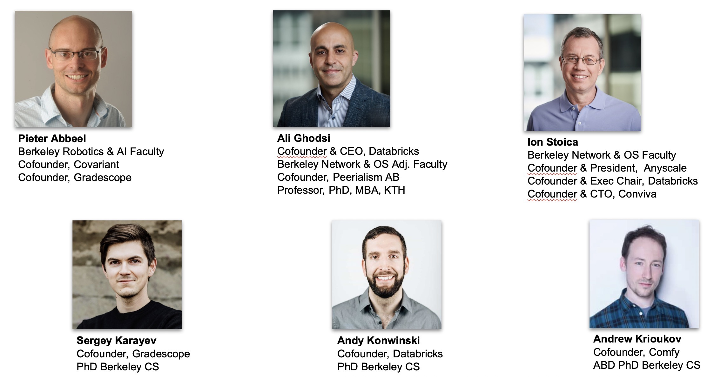
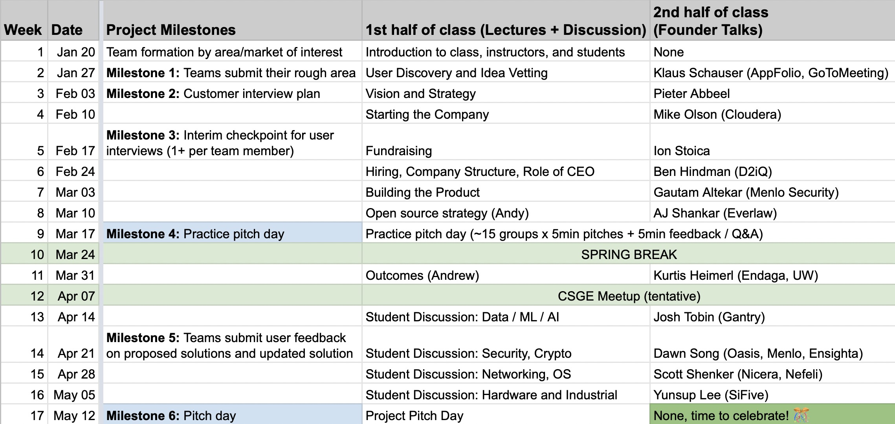

---
hide:
  - navigation
---

<h1 class="title">CS 294 - Research to Startup</h1>

UC Berkeley class for CS PhD students, taught Spring 2022

## Instructors

## Overview

As a CS graduate student, you likely understand some career paths quite well,
for example: becoming a professor, an industrial lab researcher, or a software
engineer. Starting your own company, on the other hand, probably seems quite
difficult and risky.

The objectives of this course are to:

- Outline the core challenges, risks, and rewards of founding a startup
- Give you a taste of the early parts of the process through the class project
- Expose you to materials that may be helpful if you decide to pursue a startup
- Introduce you to faculty, alumni, and other experts who have started companies and their learnings
- Introduce you to other students who are also interested in startups

This [course](https://classes.berkeley.edu/content/2022-spring-compsci-294-194-lec-194) will meet 5-7pm every Thursday, according to the schedule below. 

All communication will be done via Slack. You will be added before class
starts. You may send the instructors a direct message (or email
[cs294-194-staff@googlegroups.com](mailto:cs294-194-staff@googlegroups.com)) if
you have questions that are relevant to only you, but keep most of the
communication public to the course.

## Project

All students will be required to complete the class project as part of a 3-5
person team. The project will require you to conduct conversations with
potential users in order to identify and validate real problems and
opportunities. Your project may be centered around a research hypothesis, an
open source project, or an idea for a potential company. We hope the project
might inform your research even if you never pursue a startup.

## Schedule

During the first part of the semester, we will cover topics in the order that a
Berkeley CS PhD student might encounter them on their path to becoming a
startup founder. Classes in this part will generally consist of a 30-45 min
lecture, and then a talk by a guest speaker. Guest speakers will mostly be
experienced founders, with an emphasis on Berkeley faculty and alumni.

During the last third of the course, class sessions will consist of discussions
and guest talks about currently active areas for technical startups (e.g.,
security/crypto, data/AI, etc.).

 
